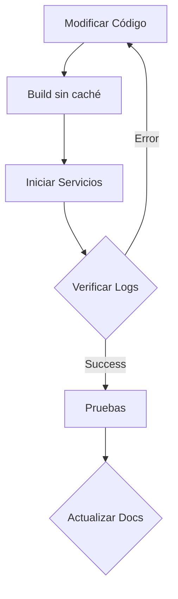
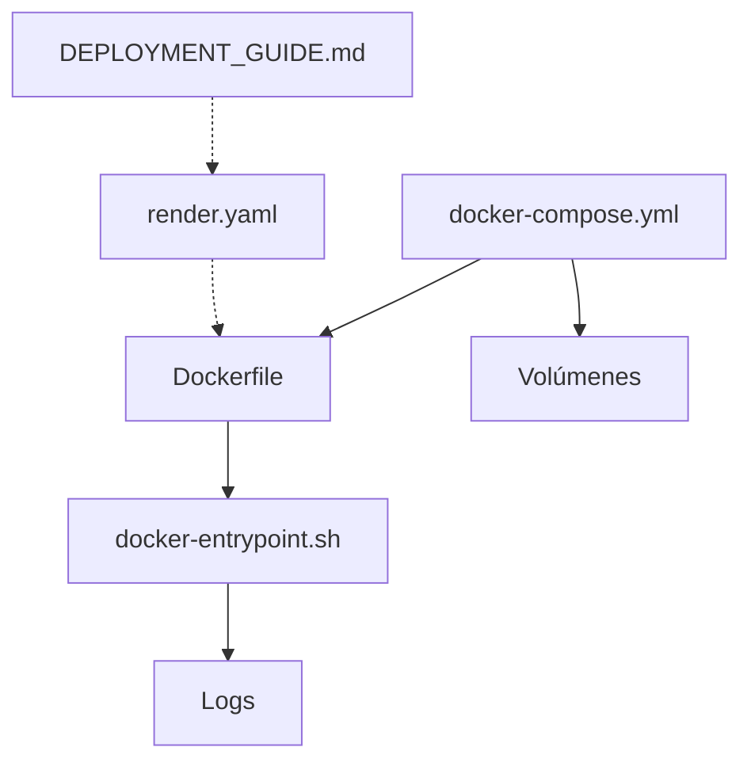

# Puntos Críticos - Integración N8N-Ollama

⚠️ **IMPORTANTE**: Esta configuración ha sido verificada solo en entorno local (Docker Desktop).
No se ha probado en entornos de producción o servicios cloud.

## 🛠️ Entorno de Desarrollo y Despliegue

### Entorno Local Verificado
```yaml
sistema_base:
  os: Windows 11 Pro
  wsl: WSL2
  docker: Docker Desktop 4.x

comandos_desarrollo:
  build: docker-compose build --no-cache
  start: docker-compose up
  stop: docker-compose down
  logs: docker-compose logs -f

volumenes_persistentes:
  - ./.n8n:/home/node/.n8n
  - ./.ollama:/root/.ollama

puertos_expuestos:
  n8n: "5678:5678"
  ollama: "11434:11434"

recursos_recomendados:
  cpu: "2+ cores"
  ram: "4+ GB"
  storage: "10+ GB"

## 🔍 Entornos

### Desarrollo (✅ VERIFICADO)
```yaml
entorno: "development"
plataforma: "Docker Desktop"
sistema_base: "Windows 11 + WSL2"
variables_entorno:
  - N8N_ENCRYPTION_KEY: [generado-dinámicamente]
  - OLLAMA_HOST: 0.0.0.0
  - OLLAMA_ORIGINS: *
  # ... otras variables de desarrollo

puertos:
  n8n: 5678
  ollama: 11434

volumenes:
  - ./.n8n:/home/node/.n8n
  - ./.ollama:/root/.ollama
```

### Producción (⚠️ PENDIENTE)
```yaml
entorno: "production"
plataforma: "Render.com"
variables_requeridas:
  N8N_ENCRYPTION_KEY:
    descripcion: "Clave de encriptación para N8N"
    tipo: "secret"
    generacion: "openssl rand -hex 24"
  
  N8N_AUTH_USERNAME:
    descripcion: "Usuario administrador de N8N"
    tipo: "secret"
    ejemplo: "admin"
  
  N8N_AUTH_PASSWORD:
    descripcion: "Contraseña del usuario admin"
    tipo: "secret"
    requisitos: "Mínimo 8 caracteres"
  
  OLLAMA_ORIGINS:
    descripcion: "Orígenes permitidos para Ollama"
    valor: "https://tu-dominio.onrender.com"

seguridad:
  - TLS/SSL habilitado
  - Autenticación básica requerida
  - Tokens JWT para API
  - Límites de rate

backups:
  - Base de datos: Diario
  - Workflows: Automático
  - Modelos: Manual
```

### Despliegue en Render.com 🚀

#### Requisitos Previos
```yaml
servicios_necesarios:
  - Web Service:
      tipo: "Docker"
      plan: "Starter Plus" # Mínimo por requisitos de memoria
      región: "Frankfurt (EU)"
      ram: "4GB"
      cpu: "2x"

configuración_render:
  dockerfile_path: "./Dockerfile"
  docker_command: "/docker-entrypoint.sh"
  auto_deploy: true
  branch: "main"
```

#### Variables de Entorno Requeridas
```yaml
# Variables Críticas (Deben configurarse en Render)
seguridad:
  N8N_BASIC_AUTH_ACTIVE: "true"
  N8N_BASIC_AUTH_USER: "admin"
  N8N_BASIC_AUTH_PASSWORD: "[contraseña-segura]"
  N8N_ENCRYPTION_KEY: "[generado-con-openssl]"
  N8N_JWT_SECRET: "[generado-con-openssl]"
  N8N_ENFORCE_SETTINGS_FILE_PERMISSIONS: "true"

configuración:
  NODE_ENV: "production"
  N8N_HOST: "0.0.0.0"
  N8N_PORT: "3000"  # Render asigna el puerto 3000
  N8N_PROTOCOL: "https"
  N8N_DISABLE_TUNNEL: "true"
  N8N_METRICS_DISABLED: "true"
  N8N_DIAGNOSTICS_DISABLED: "true"
  N8N_USER_FOLDER: "/home/node/.n8n"
  WEBHOOK_URL: "https://[tu-app].onrender.com"
  N8N_LOG_LEVEL: "verbose"
  N8N_SKIP_WEBHOOK_DEREGISTRATION: "true"

ollama:
  OLLAMA_HOST: "127.0.0.1"  # Crítico: En Render debe ser 127.0.0.1
  OLLAMA_ORIGINS: "https://[tu-app].onrender.com"
  OLLAMA_MODELS: "llama3.2:1b"
  OLLAMA_SKIP_GPU_DETECTION: "true"
  OLLAMA_CPU_ONLY: "true"

# Variable de Control de Entorno
control:
  RENDER: "true"  # Indica que estamos en entorno Render
```

#### Ajustes Necesarios
```yaml
dockerfile:
  - Usar puerto 3000 en lugar de 5678
  - Asegurar persistencia en /data
  - Optimizar capas para reducir tamaño

entrypoint:
  - Verificar conexión PostgreSQL
  - Manejar migraciones DB
  - Ajustar timeouts de inicio

seguridad:
  - Habilitar autenticación básica
  - Configurar HTTPS
  - Limitar orígenes CORS
```

#### Orden de Despliegue
1. Crear base de datos PostgreSQL
2. Obtener credenciales y URL de conexión
3. Configurar variables de entorno
4. Desplegar Web Service
5. Verificar logs y estado

#### Monitoreo en Producción
```yaml
puntos_críticos:
  - Uso de memoria
  - Conexión a PostgreSQL
  - Estado de Ollama
  - Logs de N8N

métricas:
  - Uso de CPU/RAM
  - Tiempo de respuesta
  - Errores HTTP
  - Estado de modelos
```

### ⚠️ Limitaciones Conocidas
1. Docker Desktop:
   - Rendimiento puede variar en WSL2
   - Necesita virtualización habilitada
   - Consumo de memoria significativo

2. Desarrollo Local:
   - No probado en producción
   - Sin configuración de alta disponibilidad
   - Sin estrategias de backup automático

3. Seguridad:
   - Puertos expuestos localmente
   - Sin TLS/SSL configurado
   - Autenticación básica

### 🔄 Ciclo de Desarrollo


## 🔒 Puntos Críticos para Modificaciones

Este documento debe ser revisado antes de cualquier modificación al sistema. Los siguientes puntos son críticos para el funcionamiento correcto de la integración N8N-Ollama.

### Entorno de Pruebas Verificado 🧪
```yaml
plataforma:
  - sistema: Windows 11 Pro
  - docker: Docker Desktop 4.x
  - runtime: WSL2

recursos_mínimos:
  cpu: 2 cores
  memoria: 4GB
  disco: 10GB

pruebas_realizadas:
  - Inicio/parada de servicios
  - Descarga de modelos
  - Comunicación entre servicios
  - Persistencia de datos

entornos_no_verificados:
  - Kubernetes
  - Servicios Cloud (AWS, GCP, Azure)
  - Linux nativo
  - macOS
```

### 1. Rutas y Binarios Verificados ⚠️
```plaintext
- Ollama binario: /usr/bin/ollama (desde imagen ollama/ollama:latest)
- N8N binario: Usar Node.js 20.x con npm 10.2.4
```

### 2. Estructura de Permisos 🔐
```plaintext
N8N:
- Directorio: /home/node/.n8n
- Permisos: 750
- Usuario: node:node

Ollama:
- Directorio: /root/.ollama
- Permisos: 755
- Usuario: root:root
```

### 3. Configuración de Red 🌐
```plaintext
Ollama:
- OLLAMA_HOST=0.0.0.0
- OLLAMA_ORIGINS=*
- Puerto interno: 11434

N8N:
- N8N_HOST=0.0.0.0
- Puerto interno: 5678
```

### 4. Orden de Inicio de Servicios ⚡
```plaintext
1. Configurar permisos de directorios
2. Iniciar Ollama como root
3. Esperar respuesta de Ollama en 127.0.0.1:11434
4. Iniciar N8N como usuario node
```

### 5. Archivos Críticos 📄
```plaintext
- Dockerfile: Construcción multi-etapa con ollama/ollama:latest
- docker-entrypoint.sh: Secuencia de inicio y permisos
- docker-compose.yml: Configuración de red y volúmenes
```

### 6. Versiones Verificadas 📌
```plaintext
- N8N: 1.76.1
- Ollama: latest (desde imagen oficial)
- Ubuntu: 22.04 (base)
- Node.js: 20.x
- npm: 10.2.4
```

### 7. Configuración Base Verificada 🔧
```dockerfile
# Multi-stage build
FROM ollama/ollama:latest AS ollama
FROM ubuntu:22.04

# Dependencias base
RUN apt-get update && apt-get install -y \
    curl wget python3 ca-certificates \
    gosu procps bash uuid-runtime openssl

# Node.js y npm
RUN curl -fsSL https://deb.nodesource.com/setup_20.x | bash - && \
    apt-get install -y nodejs && \
    npm install -g npm@10.2.4

# N8N instalación
RUN npm install -g n8n@1.76.1 --legacy-peer-deps
```

### 8. Variables de Entorno Críticas 🔐
```env
# Ollama
OLLAMA_HOST=0.0.0.0
OLLAMA_ORIGINS=*
OLLAMA_SKIP_GPU_DETECTION=true
OLLAMA_CPU_ONLY=true
CGO_ENABLED=0

# N8N
NODE_ENV=production
N8N_ENCRYPTION_KEY=[generado-dinámicamente]
N8N_DISABLE_TUNNEL=true
N8N_METRICS_DISABLED=true
N8N_DIAGNOSTICS_DISABLED=true
N8N_HOST=0.0.0.0
N8N_PORT=5678
```

### 9. Secuencia de Inicio Verificada 🔄
```bash
# 1. Preparación de directorios
mkdir -p /home/node/.n8n
find /home/node/.n8n -mindepth 1 -delete 2>/dev/null || true
mkdir -p /home/node/.n8n/.n8n
mkdir -p /home/node/.n8n/data
chown -R node:node /home/node/.n8n
chmod -R 750 /home/node/.n8n

# 2. Inicio de Ollama
/usr/local/bin/ollama serve &
# Esperar respuesta en puerto 11434

# 3. Inicio de N8N
cd /home/node
gosu node n8n start
# Verificar respuesta en puerto 5678
```

### 10. Solución de Problemas Comunes 🔧
1. Error "Device or resource busy":
   - No eliminar directorio raíz montado
   - Usar find para limpiar contenido

2. Error de inicio N8N:
   - Evitar flags de línea de comando
   - Usar variables de entorno
   - Asegurar permisos correctos

3. Problemas de bibliotecas:
   - Usar Ubuntu 22.04 como base
   - Instalar dependencias del sistema
   - Verificar versiones de Node.js y npm

## ⚠️ Proceso de Modificación

1. **Antes de modificar:**
   - Revisar este documento
   - Verificar que los cambios no afectan puntos críticos
   - Hacer backup de configuración actual

2. **Durante la modificación:**
   - Mantener estructura de permisos
   - Respetar orden de inicio de servicios
   - No alterar rutas verificadas

3. **Después de modificar:**
   - Verificar todos los puntos críticos
   - Probar integración completa
   - Actualizar documentación si es necesario

## 🚫 Cambios Prohibidos
- No cambiar usuarios de ejecución
- No modificar estructura de permisos
- No alterar orden de inicio de servicios
- No cambiar rutas de binarios verificados

## ✅ Verificación de Funcionamiento
```bash
# Verificar Ollama
curl http://localhost:11434/api/version

# Verificar N8N
curl http://localhost:5678/healthz
```

---
*Última actualización: 2025-02-08*

*Este documento debe ser revisado y actualizado con cada modificación exitosa del sistema.*

# Puntos Críticos del Sistema

## 1. Ollama (✅ RESUELTO)

### Dependencias Críticas
- Bibliotecas necesarias en Ubuntu:
  ```dockerfile
  RUN apt-get update && apt-get install -y \
      curl \
      wget \
      python3 \
      ca-certificates \
      gosu \
      procps \
      bash
  ```

### Estructura de Directorios
- Crear directorios necesarios:
  ```dockerfile
  RUN mkdir -p /usr/local/bin /lib/x86_64-linux-gnu
  ```

### Bibliotecas Compartidas
- Copiar solo las bibliotecas esenciales:
  ```dockerfile
  COPY --from=ollama /usr/lib/x86_64-linux-gnu/libstdc++.so* /usr/lib/x86_64-linux-gnu/
  COPY --from=ollama /usr/lib/x86_64-linux-gnu/libgcc_s.so* /usr/lib/x86_64-linux-gnu/
  ```

### Corrección de Enlaces Simbólicos
```dockerfile
RUN cd /usr/lib/x86_64-linux-gnu && \
    rm -f libstdc++.so.6 && \
    ln -s libstdc++.so.6.* libstdc++.so.6
```

### Variables de Entorno
```env
OLLAMA_HOST=0.0.0.0
OLLAMA_ORIGINS=*
OLLAMA_SKIP_GPU_DETECTION=true
OLLAMA_CPU_ONLY=true
CGO_ENABLED=0
```

### Diagnóstico de Problemas
1. Verificar que el binario es ejecutable:
   ```bash
   ls -l /usr/local/bin/ollama || ls -l /usr/bin/ollama
   ```

2. Verificar bibliotecas del sistema:
   ```bash
   ldd $(which ollama)
   ```

3. Verificar logs si falla:
   ```bash
   tail -n 50 /var/log/ollama/ollama.log
   ```

### Solución de Problemas de Bibliotecas
1. Errores de relocación:
   - Instalar las bibliotecas nativas de Alpine en lugar de copiarlas de Ollama
   - Usar las versiones -dev de las bibliotecas cuando sea necesario

2. Símbolos no encontrados:
   - Verificar que todas las bibliotecas de desarrollo están instaladas
   - Usar gcompat para compatibilidad con glibc

## 2. Directorios (✅ RESUELTO)
- /root/.ollama: 755 (root:root)
- /home/node/.n8n: 750 (node:node)

## 3. Red (✅ RESUELTO)
- Ollama: 0.0.0.0:11434
- N8N: 0.0.0.0:5678

## 4. Servicios
- Ollama: ✅ RESUELTO
- N8N: ✅ RESUELTO

### Configuración de Modelos Ollama 🤖
```yaml
models:
  default: llama3.2:1b  # Único modelo soportado actualmente
  config:
    llama3.2:1b:
      description: "Modelo LLaMA 3.2 1B - Versión ligera optimizada"
      pull_command: "ollama pull --insecure llama3.2:1b"
      verify_command: "curl -s http://127.0.0.1:11434/api/tags | grep -q \"llama3.2:1b\""
      notas:
        - "Único modelo verificado y soportado"
        - "No descargar otros modelos automáticamente"
        - "Otros modelos pueden causar problemas de memoria"
      parameters:
        context_length: 4096
        temperature: 0.7
        top_p: 0.9
        repeat_penalty: 1.1
```

#### Instrucciones de Uso
1. El modelo se descarga automáticamente al inicio si no existe
2. Para descargar manualmente: `ollama pull llama3.2:1b`
3. Para verificar la instalación: `ollama list`
4. Para actualizar el modelo: `ollama rm llama3.2:1b && ollama pull llama3.2:1b`

#### ⚠️ Importante
- No intentar descargar otros modelos
- No modificar el modelo por defecto
- Mantener solo llama3.2:1b instalado

### N8N - Lecciones Aprendidas
1. Configuración:
   - Usar variables de entorno en lugar de flags de línea de comando
   ```bash
   export N8N_DISABLE_TUNNEL=true
   export N8N_METRICS_DISABLED=true
   export N8N_DIAGNOSTICS_DISABLED=true
   export N8N_ENCRYPTION_KEY=$(openssl rand -hex 24)
   ```

2. Estructura de Directorios:
   - No eliminar el directorio raíz mientras está en uso
   - Usar find para limpiar contenido: `find /home/node/.n8n -mindepth 1 -delete`
   - Estructura mínima necesaria:
     ```
     /home/node/.n8n/
     ├── .n8n/
     └── data/
     ```

3. Inicio del Servicio:
   - Comando simple: `n8n start`
   - Evitar flags innecesarios
   - Usar gosu para cambio de usuario
   - Verificar el proceso después del inicio

4. Puntos Clave del Éxito:
   - Usar Ubuntu 22.04 como base en lugar de Alpine
   - Mantener la configuración simple y basada en variables de entorno
   - No usar flags de línea de comando innecesarios
   - Asegurar permisos y propiedad de directorios
   - Limpiar contenido sin eliminar directorios montados

### Orden de Inicio
1. Configurar permisos
2. Configurar red
3. Iniciar Ollama
4. Verificar API de Ollama
5. Iniciar N8N

## 5. Gestión de Usuarios (✅ RESUELTO)
```dockerfile
# Crear grupo y usuario node correctamente
RUN groupadd -r node && \
    useradd -r -u 1000 -g node -d /home/node -m -s /bin/bash node
```

## 6. Problemas Conocidos y Soluciones

### Ollama (✅ RESUELTO)
1. Bibliotecas faltantes: Usar Ubuntu 22.04 como base
2. Enlaces simbólicos: Crear manualmente para libstdc++
3. Permisos: Asegurar 755 para binarios

### N8N (✅ RESUELTO)
1. Error actual: --debug no es una opción válida
2. Verificar la versión correcta de N8N
3. Revisar logs en /home/node/.n8n/

## 7. Script de Entrada (✅ RESUELTO)
1. Configuración Base:
   ```bash
   #!/bin/bash
   set -e
   set -m  # Habilitar control de trabajos
   ```

2. Manejo de Señales:
   ```bash
   trap 'cleanup' SIGTERM SIGINT SIGHUP
   
   cleanup() {
       echo "Deteniendo servicios..."
       kill $OLLAMA_PID $N8N_PID
       wait $OLLAMA_PID $N8N_PID
       exit 0
   }
   ```

3. Monitoreo de Procesos:
   ```bash
   check_process() {
       if ! kill -0 $1 2>/dev/null; then
           echo "[$(date)] Proceso $2 (PID: $1) no está ejecutándose"
           return 1
       fi
       return 0
   }
   ```

4. Secuencia de Verificación:
   - Binarios y permisos
   - Bibliotecas del sistema
   - Configuración de red
   - Inicio de servicios
   - Verificación de salud

5. Logs y Diagnóstico:
   - Timestamps en todos los mensajes
   - Verificación de procesos
   - Captura de errores
   - Logs específicos por servicio

### Orden de Ejecución Verificado
1. Verificación de binarios y bibliotecas
2. Configuración de permisos
3. Configuración de red
4. Inicio de Ollama
5. Verificación de API Ollama
6. Descarga de modelo (llama3.2:1b)
7. Inicio de N8N
8. Verificación de salud N8N
9. Monitoreo continuo

## 8. Variables de Entorno Críticas 🔐
```env
# Variables Verificadas y Funcionales
# Ollama
OLLAMA_HOST=0.0.0.0
OLLAMA_ORIGINS=*
OLLAMA_SKIP_GPU_DETECTION=true
OLLAMA_CPU_ONLY=true
CGO_ENABLED=0

# N8N
NODE_ENV=production
N8N_ENCRYPTION_KEY=[generado-dinámicamente]
N8N_DISABLE_TUNNEL=true
N8N_METRICS_DISABLED=true
N8N_DIAGNOSTICS_DISABLED=true
N8N_HOST=0.0.0.0
N8N_PORT=5678
```

## 9. Modelos de IA Verificados 🤖
### Modelo Principal
```yaml
nombre: llama3.2:1b
estado: ✅ Verificado
comando_descarga: ollama pull --insecure llama3.2:1b
verificación: curl -s http://127.0.0.1:11434/api/tags | grep -q "llama3.2:1b"
```

### Gestión de Modelos
1. Descarga Automática:
   - Se intenta al inicio si no existe
   - Verificación previa a la descarga
   - Manejo de errores de descarga

2. Verificación:
   ```bash
   # Verificar modelo instalado
   ollama list
   
   # Verificar funcionamiento
   curl http://localhost:11434/api/generate -d '{
     "model": "llama3.2:1b",
     "prompt": "test"
   }'
   ```

## 10. Archivos del Proyecto 📁

### Archivos Principales
```yaml
docker:
  - Dockerfile: Configuración multi-etapa para la imagen
  - docker-compose.yml: Orquestación de servicios
  - docker-entrypoint.sh: Script principal de inicio

despliegue:
  - DEPLOYMENT_GUIDE.md: Guía de despliegue (pendiente)
  - render.yaml: Configuración para Render (no verificado)
  - PUNTOS_CRITICOS.md: Este documento

scripts:
  - push-to-github.sh: Script Linux para subir cambios
  - push-to-github.ps1: Script PowerShell para subir cambios
```

### Estado de Verificación
```yaml
verificados_local:
  - Dockerfile: ✅
  - docker-compose.yml: ✅
  - docker-entrypoint.sh: ✅

pendientes_verificacion:
  - render.yaml: ❌ No probado en producción
  - DEPLOYMENT_GUIDE.md: ❌ En desarrollo

scripts_auxiliares:
  - push-to-github.*: ⚠️ Solo para desarrollo
```

### Dependencias entre Archivos


### Diferencias Críticas Dev vs Prod
```diff
# Variable de Entorno Crítica
+ RENDER=true                   # Prod

# Variables de Entorno
- N8N_BASIC_AUTH_ACTIVE=false    # Dev
+ N8N_BASIC_AUTH_ACTIVE=true     # Prod

# Seguridad
- OLLAMA_ORIGINS=*               # Dev
+ OLLAMA_ORIGINS=https://...     # Prod
```

### Variables de Control de Entorno
```yaml
RENDER:
  descripción: "Variable crítica para diferenciar entorno"
  valores:
    - false: "Entorno de desarrollo local"
    - true: "Entorno de producción en Render.com"
  uso:
    - Controla flujo de inicio de servicios
    - Determina configuración de base de datos
    - Activa/desactiva características de seguridad
  ejemplo:
    desarrollo: |
      RENDER=false docker-compose up
    producción: |
      RENDER=true en variables de entorno de Render.com
```

### Valores por Defecto (No usar en producción)
```yaml
N8N_ENCRYPTION_KEY: "dK8xJ2mP9nQ7vR4tL5wC3bE6yH8uM1pX"  # Solo desarrollo
N8N_BASIC_AUTH_USER: "admin"  # Cambiar en producción
N8N_BASIC_AUTH_PASSWORD: "admin123"  # Cambiar en producción
```

### Notas Importantes
```yaml
puertos:
  - N8N_PORT será sobreescrito por $PORT en Render
  - Ollama debe usar 127.0.0.1 en producción

seguridad:
  - Generar claves seguras con openssl
  - No usar valores por defecto en producción
  - Habilitar autenticación básica

webhooks:
  - Configurar WEBHOOK_URL con la URL final de Render
  - Verificar redirecciones HTTPS
```

### Google Cloud Platform
```yaml
puntos_criticos:
  - Asegurar que el project_id está configurado correctamente
  - Verificar que la región es correcta (europe-west1)
  - Los puertos 80 y 22 deben estar abiertos en el security list

recursos_minimos:
  cpu: 4 vCPUs
  ram: 16GB
  storage: 100GB

directorios:
  - /n8n-ollama/data/n8n
  - /n8n-ollama/data/ollama
``` 